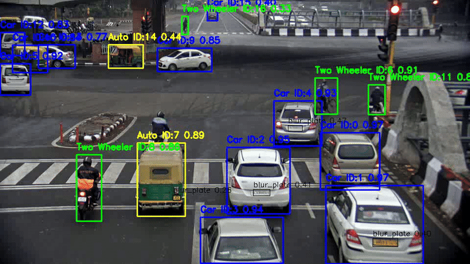

# 🚦 Advanced Vehicle Analytics & Traffic Violation Detection System

## 🎥 Project Demo

An **Intelligent Transportation System (ITS)** built using **Predictive Analytics and Computer Vision**, developed as an academic project at  
**Lovely Professional University**.

This system performs **real-time vehicle detection, speed estimation, traffic violation detection, and license plate recognition**, all integrated into an interactive **Streamlit dashboard** with automated reporting.

---

## 🎥 Live Demo & Project Video

▶️ **Watch the full project demo here**  
🔗 [View Project Video on LinkedIn](https://www.linkedin.com/feed/update/urn:li:activity:7406932700533551105/)

---

## 📌 Key Features

✅ **Multi-Class Vehicle Detection**  
Detects and classifies **7 vehicle classes**:
- Car  
- Truck  
- Bus  
- Auto  
- Two-Wheeler  
- License Plate  
- Blurred Plate  

✅ **Real-Time Speed Estimation**  
Speed calculated using centroid displacement between frames:

✅ **Traffic Violation (Overspeeding) Detection**  
Automatically flags vehicles exceeding a configurable speed threshold (e.g., **80 km/h**).

✅ **Automatic License Plate Recognition (ALPR)**  
OCR-based number plate extraction for violating vehicles.

✅ **Strategic Traffic Analytics Reports**  
Auto-generated **PDF reports** including:
- Vehicle flow analysis  
- Speed & violation trends  
- Model confidence & robustness indicators  

---

## 🧠 Technology Stack

| Component | Technology |
|---------|-----------|
| Model | YOLOv8 (Nano, Small, Medium tested) |
| Framework | Ultralytics YOLOv8 |
| Language | Python |
| Dashboard | Streamlit |
| OCR | EasyOCR |
| Database | MySQL, MS Excel |
| Visualization | OpenCV, Matplotlib |

---

## 📂 Dataset Overview

**Vehicle Detection & License Plate Dataset (v1)**

- 📸 ~960 annotated traffic images  
- 🏷️ YOLO-format labels  
- 🔀 Split:
  - Train: 772  
  - Validation: 127  
  - Test: 61  

Sources:
- Kaggle  
- Roboflow Universe  

---

## 🧪 Data Preprocessing

- Image resizing to **640 × 640**
- Pixel normalization (0–1)
- Data augmentation:
  - Mosaic augmentation
  - HSV scaling
  - Horizontal flipping

---

## 🤖 Model Performance

After comparing multiple YOLOv8 variants, **YOLOv8n (Nano)** was selected.

| Model | Parameters | mAP@50 | Inference Speed | Remarks |
|------|-----------|--------|----------------|--------|
| YOLOv8n | 3.2M | 0.829 | **6.5 ms** | ✅ Best for real-time |
| YOLOv8s | 11.2M | 0.841 | 12.8 ms | Good accuracy |
| YOLOv8m | 25.9M | 0.855 | 22.4 ms | Too slow for CPU |

📌 **YOLOv8n offers the best balance between accuracy and real-time speed.**

---

## 🖥️ Project Interface

### 📊 Streamlit Dashboard
- Upload Image / Video
- Live camera feed
- Speed threshold controls
- Real-time annotations
- Downloadable PDF report

📷 **Dashboard Preview**

(Add image: assets/dashboard.png)

---

## 📊 Automated Reporting

The system generates **Strategic Traffic & Safety Reports** including:

- 📈 Vehicle flow distribution  
- 🚦 Speed & violation analysis  
- 🔍 OCR-based license plate records  
- 📊 Confidence & robustness metrics  
- ✅ Actionable safety recommendations  

---

## 🔮 Future Scope

- 🌙 Night-time & thermal vision detection  
- ⚡ Edge deployment (Jetson Nano / Raspberry Pi)  
- 🧠 Accident prediction using LSTM  
- 🪖 Helmet detection & triple riding detection  
- 🚓 Advanced traffic rule enforcement  

---

## 👥 Contributors

### 👨‍💻 Student
**Sushant Kumar**  
B.Tech CSE, Lovely Professional University  
Registration No: **12311087**

### 👩‍🏫 Mentor
**Dr. Tanima Thakur**  
Assistant Professor, CSE/IT  
Lovely Professional University

